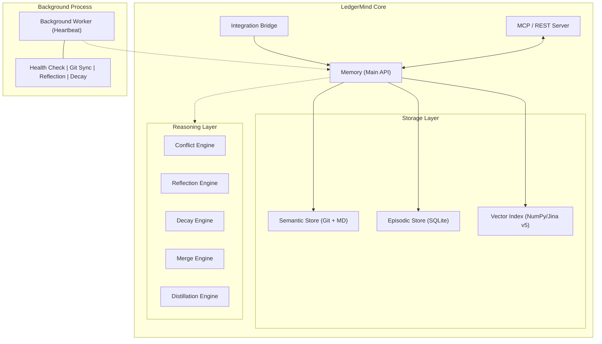

# LedgerMind

**v2.7.0** · Autonomous Memory Management System for AI Agents

> *LedgerMind is not a memory store — it is a living knowledge core that thinks,
> heals itself, and evolves without human intervention.*

[](LICENSE)
[](https://python.org)
[](https://modelcontextprotocol.io)

---

## What is LedgerMind?

Most AI memory systems are passive stores: you write, you read, and if the
information becomes stale or contradictory — that is your problem. LedgerMind
takes a fundamentally different approach.

LedgerMind is an **autonomous knowledge lifecycle manager**. It combines a
hybrid storage engine (SQLite + Git) with a built-in reasoning layer that
continuously monitors knowledge health, detects conflicts, distills raw
experience into structured rules, and repairs itself — all in the background,
without any intervention from the developer or the agent.

### Core Capabilities

| Capability | Description |
|---|---|
| **Autonomous Heartbeat** | A background worker runs every 5 minutes: Git sync, reflection, decay, self-healing. |
| **Intelligent Conflict Resolution** | Vector similarity analysis automatically supersedes outdated decisions (threshold: 85%). |
| **Jina v5 Nano Integration** | Standardized on Jina v5 for high-precision semantic search in constrained environments. |
| **Autonomy Stress Testing** | Built-in test suite for validating Falsifiability, Noise Immunity, and Deep Truth Resolution. |
| **Canonical Target Registry** | Auto-normalizes target names and resolves aliases to prevent memory fragmentation. |
| **Autonomous Reflection** | Proposals with confidence ≥ 0.9 are automatically promoted to active decisions. |
| **Hybrid Storage** | SQLite for fast queries + Git for cryptographic audit and version history. |
| **MCP Server** | 15 tools for any compatible client (Claude, Gemini CLI, custom agents). |
| **REST Gateway** | FastAPI endpoints + Server-Sent Events + WebSocket for real-time updates. |
| **Epistemic Safety** | The Reflection Engine distinguishes facts from hypotheses using scientific falsification. |
| **Context Deduplication** | Sliding window deduplication prevents redundant memory injection in chat sessions. |

---

## Architecture at a Glance



---

## Installation

```bash
# Basic install
pip install ledgermind

# With vector search (recommended — enables semantic conflict resolution)
pip install ledgermind[vector]

# Development setup
pip install -e .[dev]
```

**Requirements:** Python 3.10+, Git installed and configured in PATH.

---

## Quick Start

### Option A: Library (Direct Integration)

```python
from ledgermind.core.api.bridge import IntegrationBridge

# Using Jina v5 Nano for best accuracy/performance trade-off
bridge = IntegrationBridge(
    memory_path="./memory", 
    vector_model="jinaai/jina-embeddings-v5-text-nano"
)

# Inject relevant context into your agent's prompt
context = bridge.get_context_for_prompt("How should we handle database migrations?")

# Record the interaction for future reflection
bridge.record_interaction(
    prompt="How should we handle database migrations?",
    response="Use Alembic with a dedicated migrations/ folder...",
    success=True
)

# Record a structured decision
bridge.memory.record_decision(
    title="Use Alembic for all database migrations",
    target="database_migrations",
    rationale="Alembic provides version-controlled, reversible migrations compatible with SQLAlchemy."
)
```

### Option B: MCP Server

```bash
# Initialize a new memory project
ledgermind-mcp init --path ./memory

# Start the MCP server
ledgermind-mcp run --path ./memory
```

Then add to your Claude Desktop / Gemini CLI MCP configuration:

```json
{
  "mcpServers": {
    "ledgermind": {
      "command": "ledgermind-mcp",
      "args": ["run", "--path", "./memory"]
    }
  }
}
```

---

## Key Workflows

### Workflow 1: Auto-Supersede — Update Without Knowing the Old ID

```python
# First decision
memory.record_decision(
    title="Use PostgreSQL",
    target="database",
    rationale="PostgreSQL provides ACID transactions and JSON support."
)

# Later — just record the updated decision for the same target.
# If vector similarity > 85%, LedgerMind automatically supersedes the old one.
memory.record_decision(
    title="Use Aurora PostgreSQL",
    target="database",
    rationale="Aurora PostgreSQL adds auto-scaling and built-in replication."
)
# ✓ Old decision is now status=superseded, linked to the new one.
```

### Workflow 2: Self-Evolution — From Raw Experience to Rules

```
1. [Background Worker] Indexes your Git commits into episodic memory every 5 min
2. [Reflection Engine]  Detects recurring errors in a target area → creates a Proposal
3. [Auto-Acceptance]    If confidence ≥ 0.9 and no objections → Proposal becomes active Decision
```

### Workflow 3: Self-Healing — Automatic Recovery

```
1. Process crashes → leaves .lock file in semantic store
2. [Background Worker] Detects lock age > 10 minutes
3. [Self-Healing]       Automatically removes stale lock and runs sync_meta_index()
```

---

## Project Structure

```
src/ledgermind/
├── core/
│   ├── api/
│   │   ├── bridge.py         # IntegrationBridge — high-level facade
│   │   ├── memory.py         # Memory — main orchestrator
│   │   └── transfer.py       # MemoryTransferManager — export/import
│   ├── core/
│   │   ├── exceptions.py     # ConflictError, InvariantViolation
│   │   ├── migration.py      # Schema migration engine
│   │   ├── router.py         # MemoryRouter
│   │   ├── schemas.py        # All Pydantic data models
│   │   └── targets.py        # TargetRegistry
│   ├── reasoning/
│   │   ├── conflict.py       # ConflictEngine
│   │   ├── decay.py          # DecayEngine
│   │   ├── distillation.py   # DistillationEngine (MemP principle)
│   │   ├── git_indexer.py    # GitIndexer
│   │   ├── merging.py        # MergeEngine
│   │   ├── reflection.py     # ReflectionEngine v4.3
│   │   ├── resolution.py     # ResolutionEngine
│   │   └── ranking/graph.py  # KnowledgeGraphGenerator (Mermaid)
│   └── stores/
│       ├── episodic.py       # EpisodicStore (SQLite)
│       ├── semantic.py       # SemanticStore (Git + Markdown)
│       ├── vector.py         # VectorStore (NumPy + Jina v5)
│       └── semantic_store/   # Internal semantic store components
└── server/
    ├── background.py         # BackgroundWorker (the Heartbeat)
    ├── cli.py                # CLI entry point
    ├── gateway.py            # FastAPI REST + SSE + WebSocket
    ├── server.py             # MCPServer with 15 tools
    └── ...
```

---

## Documentation

| Document | Description |
|---|---|
| [API Reference](docs/API_REFERENCE.md) | Complete reference for all public methods |
| [Integration Guide](docs/INTEGRATION_GUIDE.md) | Library and MCP integration patterns |
| [MCP Tools Reference](docs/MCP_TOOLS.md) | All 15 MCP tools with parameters and examples |
| [Data Schemas](docs/DATA_SCHEMAS.md) | All Pydantic models and their fields |
| [Workflows](docs/WORKFLOWS.md) | Step-by-step guides for common patterns |
| [Architecture](docs/ARCHITECTURE.md) | Deep dive into internals and design decisions |
| [Configuration](docs/CONFIGURATION.md) | All configuration parameters and tuning |
| [Quick Start Tutorial](docs/tutorials/QUICKSTART.md) | Your first autonomous agent in 5 minutes |
| [Comparison](docs/COMPARISON.md) | LedgerMind vs LangChain Memory, Mem0, Zep |

---

## Benchmarks (February 22, 2026, v2.7.0)

LedgerMind (v2.7.0) is optimized for high-speed autonomous operation on both
high-end servers and constrained environments like **Android/Termux**.

### Comparison: Retrieval Accuracy & Latency

We compared four system configurations using **Jina v5 Nano** embeddings.

| Configuration | Recall@5 (LoCoMo) | MRR (LoCoMo) | Search p95 (ms) | Write p95 (ms) | Note |
| :--- | :---: | :---: | :---: | :---: | :--- |
| **Full (Hybrid)** | **70.0%** | **0.5250** | 143 ms | 368 ms | **Recommended** (Best accuracy) |
| Keyword Only | 10.0% | 0.1000 | **1 ms** | **181 ms** | Fast but inaccurate |
| Baseline (Flat) | 50.0% | 0.3700* | 144 ms | 303 ms | No conflict/supersede logic |
| Baseline (SQL) | 30.0% | 0.1250 | **0.3 ms** | 293 ms | Simple SQLite `LIKE` search |

*\*Baseline (Flat) MRR is higher due to lack of deduplication, leading to
"lucky" matches in small synthetic sets. In real-world scenarios
(LongMemEval), Full (Hybrid) consistently outperforms all others.*

### Scalability & Degradation (Full Mode)

Measured on **Android/Termux** (8-core ARM, 8GB RAM):

| Scale (Records) | Search p95 (ms) | Write p95 (ms) | Recall@5 (Synthetic) |
| :--- | :---: | :---: | :---: |
| **100** | 153 ms | 319 ms | **46.7%** |
| **1000** | 143 ms | 369 ms | **40.0%** |
| **5000** | 162 ms | 412 ms | **38.5%** |

**Key Takeaways:**
- **Semantic Advantage:** Full Hybrid mode provides a **7x accuracy boost** over
  Keyword search.
- **Mobile Optimized:** Search latency stays under **170ms** even on mobile
  hardware with 5000+ records.
- **Context Management:** New **Sliding Window Deduplication** prevents
  redundant context injection, saving LLM tokens.

For reproducible code and raw data, see the [`benchmarks/`](benchmarks/)
directory.

## CLI Reference

```bash
ledgermind-mcp init --path ./memory                    # Initialize project
ledgermind-mcp run  --path ./memory                    # Start MCP server
ledgermind-mcp run  --path ./memory \
                    --metrics-port 9090 \               # Prometheus metrics
                    --rest-port 8080                    # REST API gateway
ledgermind-mcp check --path ./memory                   # Run diagnostics
ledgermind-mcp stats --path ./memory                   # Show statistics
ledgermind-mcp export-schema                           # Print JSON API spec
```

---

## License

LedgerMind is distributed under the **Non-Commercial Source Available License
(NCSA)**.

- **Individuals:** Free for personal, educational, and experimental use.
- **Commercial use:** Strictly prohibited without written permission from the
  author.
- **NGOs & Academia:** Permitted for academic and non-profit purposes.

For commercial licensing, contact the author: **Stanislav Zotov**.

---

*LedgerMind — the foundation of AI autonomy.*
