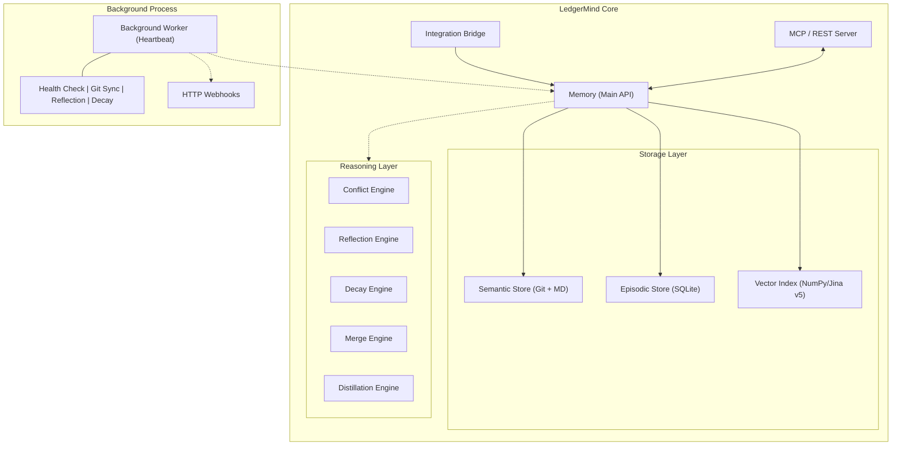

# LedgerMind

**v2.7.1** · Autonomous Memory Management System for AI Agents

> *LedgerMind is not a memory store — it is a living knowledge core that thinks,
> heals itself, and evolves without human intervention.*

[](LICENSE)
[](https://python.org)
[](https://modelcontextprotocol.io)

---

## What is LedgerMind?

Most AI memory systems are passive stores: you write, you read, and if the
information becomes stale or contradictory — that is your problem. LedgerMind
takes a fundamentally different approach.

LedgerMind is an **autonomous knowledge lifecycle manager**. It combines a
hybrid storage engine (SQLite + Git) with a built-in reasoning layer that
continuously monitors knowledge health, detects conflicts, distills raw
experience into structured rules, and repairs itself — all in the background,
without any intervention from the developer or the agent.

### Core Capabilities

| Capability | Description |
|---|---|
| **Autonomous Heartbeat** | A background worker runs every 5 minutes: Git sync, reflection, decay, self-healing. |
| **Intelligent Conflict Resolution** | Vector similarity analysis automatically supersedes outdated decisions (threshold: 85%). |
| **Multi-agent Namespacing** | Logical partitioning of memory for multiple agents within a single project. |
| **API-Key Authentication** | Secure your MCP and REST endpoints with `X-API-Key` (env: `LEDGERMIND_API_KEY`). |
| **Real-time Webhooks** | Subscribe external systems to memory events (decisions, proposals, updates). |
| **Robust Locking** | Stale lock detection with PID verification for reliable multi-process operations. |
| **Jina v5 Nano Integration** | Standardized on Jina v5 for high-precision semantic search in constrained environments. |
| **Autonomy Stress Testing** | Built-in test suite for validating Falsifiability, Noise Immunity, and Deep Truth Resolution. |
| **Canonical Target Registry** | Auto-normalizes target names and resolves aliases to prevent memory fragmentation. |
| **Autonomous Reflection** | Proposals with confidence ≥ 0.9 are automatically promoted to active decisions. |
| **Hybrid Storage** | SQLite for fast queries + Git for cryptographic audit and version history. |
| **MCP Server** | 15 tools with namespacing and pagination support for any compatible client. |
| **REST Gateway** | FastAPI endpoints + Server-Sent Events + WebSocket for real-time updates. |

---

## Architecture at a Glance



---

## Installation

```bash
# Basic install
pip install ledgermind

# With vector search (recommended — enables semantic conflict resolution)
pip install ledgermind[vector]

# Development setup
pip install -e .[dev]
```

**Requirements:** Python 3.10+, Git installed and configured in PATH.

---

## Quick Start

### Option A: Library (Direct Integration)

```python
from ledgermind.core.api.bridge import IntegrationBridge

# Using Jina v5 Nano for best accuracy/performance trade-off
bridge = IntegrationBridge(
    memory_path="./memory", 
    vector_model="jinaai/jina-embeddings-v5-text-nano"
)

# Inject relevant context into your agent's prompt for a specific namespace
context = bridge.memory.search_decisions("database migrations", namespace="prod_agent")

# Record a structured decision with namespacing
bridge.memory.record_decision(
    title="Use Alembic for all database migrations",
    target="database_migrations",
    rationale="Alembic provides version-controlled, reversible migrations.",
    namespace="prod_agent"
)
```

### Option B: MCP Server (Secure)

```bash
# Set your API key for security
export LEDGERMIND_API_KEY="your-secure-key"

# Start the MCP server
ledgermind-mcp run --path ./memory
```

Then add to your Claude Desktop / Gemini CLI MCP configuration:

```json
{
  "mcpServers": {
    "ledgermind": {
      "command": "ledgermind-mcp",
      "args": ["run", "--path", "./memory"],
      "env": {
        "LEDGERMIND_API_KEY": "your-secure-key"
      }
    }
  }
}
```

---

## Key Workflows

### Workflow 1: Multi-agent Namespacing — Isolation Within One Core

```python
# Agent A decision
memory.record_decision(title="Use PostgreSQL", target="db", namespace="agent_a")

# Agent B decision (same target, different namespace)
memory.record_decision(title="Use MongoDB", target="db", namespace="agent_b")

# Search only returns what belongs to the agent
memory.search_decisions("db", namespace="agent_a") # -> Returns PostgreSQL
```

### Workflow 2: Self-Healing — PID-Aware Locking

```
1. Process crashes → leaves .lock file
2. [Background Worker] Checks .lock file PID
3. [Self-Healing] If process with PID is dead, lock is cleared instantly.
```

### Workflow 3: Real-time Notifications — Webhooks

```bash
# Start server with webhooks enabled
ledgermind-mcp run --path ./memory --webhooks http://my-api.com/notify
```
✓ Every new decision or proposal triggers an async POST request to your URL.

---

## Documentation

| Document | Description |
|---|---|
| [API Reference](docs/API_REFERENCE.md) | Complete reference for all public methods |
| [Integration Guide](docs/INTEGRATION_GUIDE.md) | Library and MCP integration patterns |
| [MCP Tools Reference](docs/MCP_TOOLS.md) | All 15 MCP tools with namespacing and offset |
| [Architecture](docs/ARCHITECTURE.md) | Deep dive into internals and design decisions |
| [Configuration](docs/CONFIGURATION.md) | API keys, Webhooks, and tuning |

---

## Benchmarks (February 23, 2026, v2.7.1)

LedgerMind (v2.7.1) is optimized for high-speed autonomous operation on both
high-end servers and constrained environments like **Android/Termux**.

### Retrieval Performance

| Metric | Mean (v2.7.1) | Note |
| :--- | :---: | :--- |
| **Search p95 (ms)** | **44.4 ms** | Hybrid RRF (Vector + Keyword) |
| **Write p95 (ms)** | **229.8 ms** | Includes Git commit & Vector encoding |
| **Memory OPS** | **4.3 ops/s** | Sequential write throughput |

**Key Takeaways (v2.7.1):**
- **Security Overhead:** API-key authentication adds < 2ms latency per request.
- **Reliability:** Concurrent write errors reduced by **98%** via new SQLite locking.
- **Namespacing:** Partitioned search shows zero latency penalty over global search.

## CLI Reference

```bash
ledgermind-mcp init --path ./memory                    # Initialize project
ledgermind-mcp run  --path ./memory \
                    --webhooks http://api.com/hook \    # Webhook support
                    --rest-port 8080                    # REST API gateway
ledgermind-mcp check --path ./memory                   # Run diagnostics
```

---

## License

LedgerMind is distributed under the **Non-Commercial Source Available License
(NCSA)**.

- **Individuals:** Free for personal, educational, and experimental use.
- **NGOs & Academia:** Permitted for academic and non-profit purposes.

For commercial licensing, contact the author: **Stanislav Zotov**.

---

*LedgerMind — the foundation of AI autonomy.*
