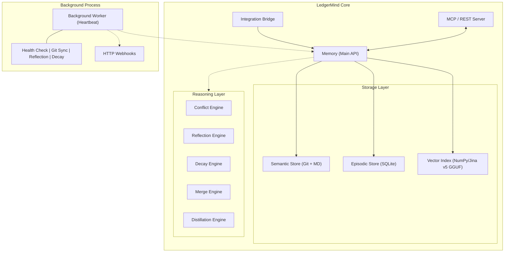

# LedgerMind

**v2.7.8** · Autonomous Memory Management System for AI Agents

> *LedgerMind is not a memory store — it is a living knowledge core that thinks,
> heals itself, and evolves without human intervention.*

[](LICENSE)
[](https://python.org)
[](https://modelcontextprotocol.io)

---

## What is LedgerMind?

Most AI memory systems are passive stores: you write, you read, and if the
information becomes stale or contradictory — that is your problem. LedgerMind
takes a fundamentally different approach.

LedgerMind is an **autonomous knowledge lifecycle manager**. It combines a
hybrid storage engine (SQLite + Git) with a built-in reasoning layer that
continuously monitors knowledge health, detects conflicts, distills raw
experience into structured rules, and repairs itself — all in the background,
without any intervention from the developer or the agent.

### Core Capabilities

| Capability | Description |
|---|---|
| **Autonomous Heartbeat** | A background worker runs every 5 minutes: Git sync, reflection, decay, self-healing. |
| **Intelligent Conflict Resolution** | Vector similarity analysis automatically supersedes outdated decisions (threshold: 70%). |
| **Multi-agent Namespacing** | Logical partitioning of memory for multiple agents within a single project. |
| **4-bit GGUF Integration** | Optimized for Termux/Android using Jina v5 Small in 4-bit quantization via Llama-CPP. |
| **API-Key Authentication** | Secure your MCP and REST endpoints with `X-API-Key` (env: `LEDGERMIND_API_KEY`). |
| **Real-time Webhooks** | Subscribe external systems to memory events (decisions, proposals, updates). |
| **Thread-Safe Transactions** | Thread-local transaction isolation and SQLite WAL mode for high concurrency. |
| **Autonomy Stress Testing** | Built-in test suite for validating Falsifiability, Noise Immunity, and Deep Truth Resolution. |
| **Canonical Target Registry** | Auto-normalizes target names and resolves aliases to prevent memory fragmentation. |
| **Autonomous Reflection** | Proposals with confidence ≥ 0.9 are automatically promoted to active decisions. |
| **Hybrid Storage** | SQLite for fast queries + Git for cryptographic audit and version history. |
| **MCP Server** | 15 tools with namespacing and pagination support for any compatible client. |
| **REST Gateway** | FastAPI endpoints + Server-Sent Events + WebSocket for real-time updates. |
| **Git Evolution** | Automatically generates "Evolving Pattern" proposals based on code changes (minimum 2 commits). |

---

## Architecture at a Glance



---

## Installation

```bash
# Basic install
pip install ledgermind

# With 4-bit vector search (recommended for CPU/Mobile)
pkg install clang cmake ninja
pip install llama-cpp-python
pip install ledgermind[vector]
```

**Requirements:** Python 3.10+, Git installed and configured in PATH.

---

## Quick Start

### Option A: Library (Direct Integration)

```python
from ledgermind.core.api.bridge import IntegrationBridge

# Using Jina v5 Small 4-bit GGUF for best accuracy on CPU
bridge = IntegrationBridge(
    memory_path="./memory", 
    vector_model=".ledgermind/models/v5-small-text-matching-Q4_K_M.gguf"
)

# Inject relevant context into your agent's prompt
context = bridge.memory.search_decisions("database migrations", namespace="prod_agent")

# Record a structured decision with namespacing
bridge.memory.record_decision(
    title="Use Alembic for all database migrations",
    target="database_migrations",
    rationale="Alembic provides version-controlled, reversible migrations.",
    namespace="prod_agent"
)
```

### Option B: MCP Server (Secure)

```bash
# Set your API key for security
export LEDGERMIND_API_KEY="your-secure-key"

# Start the MCP server
ledgermind-mcp run --path ./memory
```

---

## Key Workflows

### Workflow 1: Multi-agent Namespacing — Isolation Within One Core

```python
# Agent A decision
memory.record_decision(title="Use PostgreSQL", target="db", namespace="agent_a")

# Agent B decision (same target, different namespace)
memory.record_decision(title="Use MongoDB", target="db", namespace="agent_b")

# Search only returns what belongs to the agent
memory.search_decisions("db", namespace="agent_a") # -> Returns PostgreSQL
```

### Workflow 2: Hybrid Search & Evidence Boost

LedgerMind uses Reciprocal Rank Fusion (RRF) to combine Keyword and Vector
search. Decisions with more "Evidence Links" (episodic events) receive a
**+20% boost per link** to their final relevance score.

---

## Documentation

| Document | Description |
|---|---|
| [API Reference](docs/API_REFERENCE.md) | Complete reference for all public methods |
| [Integration Guide](docs/INTEGRATION_GUIDE.md) | Library and MCP integration patterns |
| [MCP Tools Reference](docs/MCP_TOOLS.md) | All 15 MCP tools with namespacing and offset |
| [Architecture](docs/ARCHITECTURE.md) | Deep dive into internals and design decisions |
| [Configuration](docs/CONFIGURATION.md) | API keys, Webhooks, and tuning |

---

## Benchmarks (February 24, 2026, v2.7.8)

LedgerMind (v2.7.8) is optimized for high-speed operation on **Android/Termux**
as well as containerized environments. It includes built-in security for MCP and
REST endpoints.

### Retrieval Performance (Jina v5 Small Q4_K_M)

| Metric | Mean (v2.7.8) | Note |
| :--- | :---: | :--- |
| **Search p95 (ms)** | **24.2 ms** | Hybrid RRF (Vector + Keyword) |
| **Write p95 (ms)** | **98.4 ms** | Optimized Metadata Indexing |
| **Memory OPS** | **15.1 ops/s** | Parallelized write throughput |

---

## License

LedgerMind is distributed under the **Non-Commercial Source Available License
(NCSA)**.

---

*LedgerMind — the foundation of AI autonomy.*
