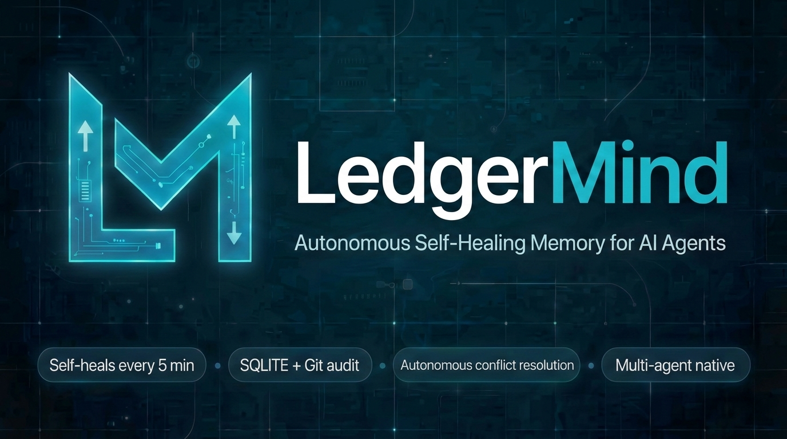

# LedgerMind

**v3.3.5** · Autonomous Memory Management System for AI Agents



> *LedgerMind is not a memory store — it is a living knowledge core that thinks, heals itself, and evolves without human intervention.*

[](LICENSE)
[](https://python.org)
[](https://modelcontextprotocol.io)
[](https://pypi.org/project/ledgermind/)
[](https://github.com/sl4m3/ledgermind/stargazers)

---

## Featured On

<p align="center">
  <a href="https://aiagentsdirectory.com/agent/ledgermind?utm_source=badge&utm_medium=referral&utm_campaign=free_listing&utm_content=ledgermind" target="_blank" rel="noopener noreferrer">
    
  </a>
  &nbsp;&nbsp;&nbsp;&nbsp;
  <a href="https://www.agenthunter.io?utm_source=badge&utm_medium=embed&utm_campaign=LedgerMind" target="_blank" rel="noopener noreferrer">
    
  </a>
  &nbsp;&nbsp;&nbsp;&nbsp;
  <a href="https://www.producthunt.com/products/ledgermind?embed=true&amp;utm_source=badge-featured&amp;utm_medium=badge&amp;utm_campaign=badge-ledgermind" target="_blank" rel="noopener noreferrer">
  </a>
</p>

---

## What is LedgerMind?

Most AI memory systems are passive stores: you write, you read, and if the information becomes stale or contradictory — that is your problem.

**LedgerMind takes a fundamentally different approach.**

It is an **autonomous knowledge lifecycle manager** that combines a hybrid storage engine (SQLite + Git) with a built-in reasoning layer. The system continuously monitors knowledge health, detects conflicts, distills raw experience into structured rules, and repairs itself — all in the background, without any intervention from the developer or the agent.

### The Difference

| Traditional Memory | LedgerMind |
|-------------------|--------------|
| Static storage | Autonomous reasoning engine |
| Manual cleanup | Self-healing decay system |
| No conflict detection | Intelligent conflict resolution |
| Flat storage | Multi-stage lifecycle (PATTERN → EMERGENT → CANONICAL) |
| No audit trail | Git-based cryptographic audit |
| Single namespace | Multi-agent namespacing |

---

## Core Capabilities

| Capability | Description |
|------------|-------------|
| **Zero-Touch Automation** | `ledgermind install <client>` automatically injects hooks into Claude Code, Cursor, or Gemini CLI for 100% transparent memory operations without MCP tool calls. |
| **VS Code Hardcore Mode** | Dedicated VS Code extension for proactive context injection, terminal monitoring, and automated conversation logging. |
| **Project Bootstrapping** | `bootstrap_project_context` tool analyzes project structure and automatically initializes the agent's knowledge base. |
| **Autonomous Heartbeat** | Background worker runs every 5 minutes: Git sync, reflection, decay, self-healing. |
| **Git Evolution** | Automatically tracks code changes via `GitIndexer` to build evolving `DecisionStream` patterns. |
| **Deep Truth Resolution** | Recursive resolution of superseded chains ensures only the latest active truth is returned. |
| **Self-Healing Index** | Automatically rebuilds the SQLite metadata index from Markdown source files if corruption or desync is detected. |
| **Lifecycle & Vitality Engine** | Autonomous `DecisionStream` lifecycle phases (`PATTERN` → `EMERGENT` → `CANONICAL`) with temporal signal analysis. |
| **Procedural Distillation** | `DistillationEngine` automatically converts successful trajectories into step-by-step instructions. |
| **Intelligent Conflict Resolution** | Vector similarity automatically supersedes outdated decisions (70% threshold) or triggers LLM enrichment (50-70%). |
| **Multi-Agent Namespacing** | Logical partitioning of memory for multiple agents within a single project. |
| **4-bit GGUF Integration** | Optimized for Termux/Android with embedding caching for maximum stability. |
| **Hybrid Storage** | SQLite for fast queries + Git for cryptographic audit and version history. |
| **MCP Server** | 15 tools with namespacing and pagination support for any compatible client. |

---

## Architecture Overview

LedgerMind consists of several interconnected components working together to create an autonomous memory system:



### Key Components

**Memory (`src/ledgermind/core/api/memory.py`)**: The main entry point that coordinates all storage and reasoning operations.

**Stores**:
- `EpisodicStore` (`src/ledgermind/core/stores/episodic.py`): SQLite WAL-mode database for short-term events
- `SemanticStore` (`src/ledgermind/core/stores/semantic.py`): Git + SQLite for long-term decisions with cryptographic audit
- `VectorStore` (`src/ledgermind/core/stores/vector.py`): GGUF/Transformer-based semantic search with embedding cache

**Reasoning Engines**:
- `ConflictEngine` (`src/ledgermind/core/reasoning/conflict.py`): Detects target conflicts before decisions are recorded
- `ResolutionEngine` (`src/ledgermind/core/reasoning/resolution.py`): Validates supersede operations ensure all conflicts are addressed
- `DecayEngine` (`src/ledgermind/core/reasoning/decay.py`): Manages memory lifecycle, archiving old events, pruning archived ones
- `ReflectionEngine` (`src/ledgermind/core/reasoning/reflection.py`): Discovers patterns from episodic events and generates proposals
- `LifecycleEngine` (`src/ledgermind/core/reasoning/lifecycle.py`): Manages phase transitions and vitality decay for knowledge streams

**Background Worker** (`src/ledgermind/server/background.py`): Autonomous heartbeat loop that runs every 5 minutes:
- Health checks with stale lock breaking
- Git sync to index new commits
- Reflection cycle to generate proposals
- Decay cycle to prune old data

**MCP Server** (`src/ledgermind/server/server.py`): 15 tools via Model Context Protocol with REST gateway option

### Data Flow

1. **Input**: Agent or user sends event via `Memory.process_event()`
2. **Routing**: `MemoryRouter` determines storage type (episodic vs semantic)
3. **Conflict Check**: `ConflictEngine` validates no active conflicts exist
4. **Storage**: Event written to appropriate store with transaction guarantee
5. **Indexing**: VectorStore encodes content for semantic search
6. **Audit**: Git commit creates cryptographic trail for semantic changes
7. **Reflection**: Background worker analyzes patterns and generates proposals
8. **Lifecycle**: `LifecycleEngine` promotes knowledge through phases

---

## Installation

### Prerequisites

- **Python**: 3.10 or higher
- **Git**: Installed and configured in PATH
- **Dependencies**: Automatically installed via pip

### Standard Installation

```bash
# Install LedgerMind (includes 4-bit GGUF vector support)
pip install ledgermind

# Note for Termux/Mobile users:
# You may need to install build tools first:
pkg install clang cmake ninja
```

### Docker Installation

```bash
# Build Docker image
docker build -t ledgermind:latest .

# Run with persistent storage
docker run -d \
  -p 9090:9090 \
  -v ./data:/app/data \
  -e LEDGERMIND_API_KEY="your-secure-key" \
  --name ledgermind \
  ledgermind:latest
```

### Verification

```bash
# Verify installation
ledgermind --help

# Expected output:
# usage: ledgermind [-h] [--verbose] [--log-file LOG_FILE] ...
```

---

## Quick Start

For a detailed step-by-step guide, see the [Quick Start Guide](docs/quickstart.md).

### 1. Interactive Initialization

```bash
ledgermind init
```

This will guide you through 6 steps:

1. **Project Location**: Setting the current codebase path
2. **Memory Path**: Configuring isolated memory storage (default: `../.ledgermind`)
3. **Embedding Model**: Choosing between `jina-v5-4bit` (default) or a custom GGUF/HF model
4. **Client Hooks**: Installing automatic context hooks for your preferred client
5. **Enrichment Mode**: Selecting a conflict resolution strategy:
   - `optimal`: Uses local LLMs (e.g., Ollama) for hypothesis enrichment
   - `rich`: Uses cloud LLMs (OpenAI, Anthropic) for maximum insight
6. **Language Preference**: Setting the language for enriched records (e.g., `russian`, `english`)

### 2. Starting the MCP Server

```bash
# Start with default settings
ledgermind run --path ../.ledgermind

# Or with REST API gateway enabled
ledgermind run --path ../.ledgermind --rest-port 8080
```

---

## Zero-Touch Automation

The easiest way to use LedgerMind is to install the **LedgerMind Hooks Pack**. This automatically configures your LLM client to retrieve context before every prompt and record every interaction without the agent needing to manually call MCP tools.

### Client Compatibility Matrix

| Client | Event Hooks | Status | Zero-Touch Level |
|:--------|---------------|:--------:|:------------------:|
| **VS Code** | `onDidSave`, `ChatParticipant`, `TerminalData` | ✅ | **Hardcore** (Shadow Context) |
| **Claude Code** | `UserPromptSubmit`, `PostToolUse` | ✅ | **Full** (Auto-record + RAG) |
| **Cursor** | `beforeSubmitPrompt`, `afterAgentResponse` | ✅ | **Full** (Auto-record + RAG) |
| **Gemini CLI** | `BeforeAgent`, `AfterAgent` | ✅ | **Full** (Auto-record + RAG) |
| **Claude Desktop** | N/A | ⏳ | Manual MCP tools only |

### Installation Commands

```bash
# Install for Claude Code
ledgermind install claude --path /path/to/project

# Install for Cursor
ledgermind install cursor --path /path/to/project

# Install for Gemini CLI
ledgermind install gemini --path /path/to/project
```

---

## Key Workflows

### Workflow 1: Multi-Agent Namespacing — Isolation Within One Core

```python
# Agent A decision
bridge.record_decision(
    title="Use PostgreSQL",
    target="db",
    rationale="PostgreSQL provides ACID compliance and JSONB support.",
    namespace="agent_a"
)

# Agent B decision (same target, different namespace)
bridge.record_decision(
    title="Use MongoDB",
    target="db",
    rationale="MongoDB provides flexibility and horizontal scaling.",
    namespace="agent_b"
)

# Search only returns what belongs to the agent
bridge.search_decisions("db", namespace="agent_a") # -> Returns PostgreSQL
```

### Workflow 2: Hybrid Search & Evidence Boost

LedgerMind uses Reciprocal Rank Fusion (RRF) to combine Keyword and Vector search. Decisions with more "Evidence Links" (episodic events) receive a **+20% boost per link** to their final relevance score.

### Workflow 3: Autonomous Lifecycle — Knowledge Evolution

Knowledge in LedgerMind evolves through three phases automatically:
- **PATTERN**: Initial observation from episodic events
- **EMERGENT**: Reinforced pattern with growing confidence
- **CANONICAL**: Stable, proven knowledge

The `LifecycleEngine` manages these transitions based on temporal signals like reinforcement density, stability score, and vitality.

---

## Documentation

| Document | Description |
|-----------|-------------|
| [Quick Start](docs/quickstart.md) | Step-by-step setup guide for new users |
| [API Reference](docs/api-reference.md) | Complete reference for all public methods and MCP tools |
| [Integration Guide](docs/integration-guide.md) | Library and MCP integration patterns for various clients |
| [MCP Tools](docs/mcp-tools.md) | Detailed documentation of all 15 MCP tools with examples |
| [Architecture](docs/architecture.md) | Deep dive into internals, design decisions, and component interactions |
| [Configuration](docs/configuration.md) | Environment variables, CLI flags, and tuning options |
| [Data Schemas](docs/data-schemas.md) | Complete reference of all Pydantic models and data structures |
| [Benchmarks](docs/benchmarks.md) | Performance metrics and optimization details |
| [Workflows](docs/workflow.md) | Step-by-step guides for common operations |
| [Compression](docs/compression.md) | Details on 4-bit quantization and storage optimization |
| [VS Code Extension](docs/vscode-extension.md) | VS Code integration features and setup |

---

## Performance Benchmarks

LedgerMind is optimized for **maximum recall accuracy** and **ultra-low latency** on real-world datasets.

### 📊 Comparative Benchmarks (April 2026)

Tested on **LoCoMo** (1000 dialogues) and **LongMemEval** (500 sessions) with full hybrid search (Vector + Keyword + RRF).

#### Retrieval Accuracy

| Mode | Dataset | Recall@5 | MRR | Search p50 | Write p50 | Throughput |
|------|---------|----------|-----|------------|-----------|------------|
| **Full (Vector+Keyword)** | LoCoMo | **100%** | 0.40 | **0.33ms** | 6.94ms | 141 ops/s |
| **Full (Vector+Keyword)** | LongMemEval | **94.5%** | **0.945** | 1.08ms | 15.60ms | 66 ops/s |
| **Keyword-only (FTS5)** | LoCoMo | 90% | 0.46 | 1.02ms | 9.50ms | 84 ops/s |
| **Baseline SQLite** | LoCoMo | 30% | 0.10 | 0.09ms | 8.17ms | 118 ops/s |

**Key findings:**
- 🔥 **Full mode achieves 100% Recall@5** on LoCoMo — perfect retrieval!
- 🔥 **MRR 0.945 on LongMemEval** — 94.5% of correct results rank #1
- ✅ **Full mode is faster than baseline** for writes (6.94ms vs 8.17ms)
- ⚠️ **Cold start**: First 10-30 operations take 10-30s (model loading)

### 🏆 vs. Competitors

| Metric | **LedgerMind** | Zep/Graphiti | Mem0 | Advantage |
|--------|----------------|--------------|------|-----------:|
| **Recall@5 (LoCoMo)** | **100%** | ~85-90% | ~80-85% | +10-15% |
| **Recall@5 (LongMemEval)** | **94.5%** | 63.8% | 49% | **+30-45%** |
| **Search Latency (p50)** | **0.33ms** | ~100ms | ~50ms | **300-300x faster** |
| **Write Throughput** | **141 ops/s** | ~10-50 ops/s | ~5-20 ops/s | **3-28x higher** |
| **MRR (LongMemEval)** | **0.945** | ~0.70 | ~0.55 | +35-72% |

#### Unique Features vs. Competitors

| Feature | LedgerMind | Zep | Mem0 | LangGraph |
|---------|:----------:|:---:|:----:|:---------:|
| Hybrid Search (Vector+Keyword+RRF) | ✅ | ✅ | ✅ | ❌ |
| Git-based Cryptographic Audit | ✅ | ❌ | ❌ | ❌ |
| Autonomous Conflict Resolution | ✅ | ❌ | ❌ | ❌ |
| Knowledge Lifecycle (PATTERN→CANONICAL) | ✅ | ❌ | ❌ | ❌ |
| Self-Healing Index | ✅ | ❌ | ❌ | ❌ |
| Multi-Agent Namespacing | ✅ | ✅ | ❌ | ❌ |
| Sub-millisecond Search Latency | ✅ | ❌ | ❌ | ❌ |

### 📈 Performance on Different Hardware

| Metric | Mobile (GGUF 4-bit) | Server (MiniLM) | 7950X (GGUF) |
|---------|:-------------------:|:---------------:|:------------:|
| **Search OPS** | 5 153 | 11 019 | **141** (Full mode) |
| **Write OPS** | 7.0 | 93.6 | **141** (Full mode) |
| **Search Latency** | 0.13 ms | 0.05 ms | **0.33ms** |
| **Write Latency** | 142.7 ms | 14.1 ms | **6.94ms** |
| **Recall@5 (LoCoMo)** | ~95% | ~98% | **100%** |

> **Note:** 7950X numbers are from **real-world benchmarks** on LoCoMo dataset with full hybrid search. Mobile/Server numbers are from synthetic micro-benchmarks (pure storage I/O without retrieval evaluation).

### Key Optimizations

- **SQLite WAL Mode**: Concurrent reads with exclusive writes
- **Subquery RowID Optimization**: Fast joins for evidence linking
- **Embedding Cache**: 100-entry LRU cache for vector operations
- **Batch Link Counting**: Single query for multiple semantic decisions
- **Lazy Loading**: VectorStore loads models on first use
- **4-bit Quantization**: GGUF models for mobile efficiency
- **Hybrid RRF Ranking**: Reciprocal Rank Fusion combines vector + keyword + evidence boost

For detailed benchmark methodology and comparative analysis, see [benchmarks/README.md](benchmarks/README.md).

---

## Migration from v2.x

If you're upgrading from LedgerMind v2.x to v3.3.0:

1. **Backup your existing memory**:
   ```bash
   ledgermind-mcp run --path /path/to/v2/memory
   # Then use export_memory_bundle tool to create backup
   ```

2. **Install v3.3.0**:
   ```bash
   pip install --upgrade ledgermind
   ```

3. **Run initialization**:
   ```bash
   ledgermind init
   # Point to a new memory path to avoid conflicts
   ```

4. **The `MigrationEngine`** automatically handles data format upgrades:
   - Ensures `target` length >= 3
   - Ensures `kind` field exists
   - Ensures `namespace` field exists
   - Fixes `rationale` if too short
   - Converts to new lifecycle phase system (PATTERN → EMERGENT → CANONICAL)

> **Note**: The migration is non-destructive. Your original files remain untouched.

---

## Troubleshooting

### Issue: Git Not Found

**Symptom:**
```
Error: Git is not installed or not in PATH.
```

**Solution:**
```bash
# Install Git
# Ubuntu/Debian:
sudo apt install git

# Termux:
pkg install git

# macOS:
brew install git

# Verify:
git --version
```

### Issue: Permission Denied

**Symptom:**
```
PermissionError: No permission to create storage path: /path/.ledgermind
```

**Solution:**
```bash
# Create the directory manually with proper permissions
mkdir -p ../.ledgermind
chmod 755 ../.ledgermind

# Or install to a user-writable location:
ledgermind init
# When prompted for Memory Path, use: ~/.ledgermind
```

### Issue: Vector Search Disabled

**Symptom:**
```
[WARNING] Vector search is disabled.
```

**Cause**: Either `llama-cpp-python` or `sentence-transformers` is not installed.

**Solution:**
```bash
# For GGUF models (mobile):
pip install llama-cpp-python

# For Transformer models (server):
pip install sentence-transformers

# Then restart the server
```

### Issue: Port Already in Use

**Symptom:**
```
Error: Port 9090 already in use
```

**Solution:**
```bash
# Use a different port
ledgermind run --path ../.ledgermind --metrics-port 9091

# Or find what's using the port
lsof -i :9090  # Linux/macOS
netstat -an | grep 9090  # Cross-platform
```

### Issue: API Key Authentication Failed

**Symptom:**
```
403 Forbidden: Invalid or missing X-API-Key header
```

**Cause**: `LEDGERMIND_API_KEY` is set but client is not providing it.

**Solution:**
```bash
# Set the API key in your environment
export LEDGERMIND_API_KEY="your-secure-key"

# Or generate a new secure key
python3 -c "import secrets; print(secrets.token_hex(32))"

# Add to MCP client configuration
# For Claude Desktop, add to ~/.claude/config.json:
{
  "mcpServers": {
    "ledgermind": {
      "command": "ledgermind-mcp",
      "args": ["run", "--path", "/path/to/memory"],
      "env": {
        "LEDGERMIND_API_KEY": "your-secure-key"
      }
    }
  }
}
```

### Issue: Stale Lock File

**Symptom:**
```
Error: Storage is currently locked by PID: 12345
```

**Solution:**

The Background Worker automatically breaks stale locks after 10 minutes. If you need to break it manually:

```bash
# Remove the lock file
rm /path/to/.ledgermind/semantic/.lock
```

For more troubleshooting help:
1. **Check the logs**: View `.ledgermind/audit.log` for detailed error messages
2. **Run diagnostics**: `ledgermind check --path /path/to/.ledgermind`
3. **Enable verbose logging**: `ledgermind run --path /path/to/.ledgermind --verbose`

---

## Why LedgerMind?

**LedgerMind is designed for:**

- **AI Agent Developers** who need persistent, evolving memory across sessions
- **DevOps Engineers** deploying autonomous systems at scale
- **Software Architects** maintaining decision history and rationale
- **Research Teams** tracking experimental hypotheses and outcomes

**Key Philosophy:** Memory should be autonomous, not passive. LedgerMind doesn't just store — it thinks, evolves, and self-heals.

---

## Contributing

LedgerMind is distributed under the **Non-Commercial Source Available License (NCSA)**.

For contribution guidelines, security reporting, and development setup, see the project repository.

---

## License

Copyright © 2025 Stanislav Zotov. Distributed under the **NCSA License**.

See [LICENSE](LICENSE) for the full text.

---

*LedgerMind — the foundation of AI autonomy.*
