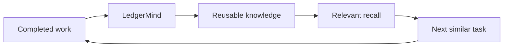

<p align="center">
  
</p>

<h1 align="center">LedgerMind</h1>

<p align="center">
  <strong>Your agent solved it once. It should not have to solve it from scratch again.</strong>
</p>

<p align="center">
  
  
  
  
</p>

<p align="center">
  <a href="#installation">Get started</a> ·
  <a href="#workflow-memory-measured-end-to-end">See the results</a> ·
  <a href="#your-knowledge-stays-local-by-design">Security</a> ·
  <a href="BENCHMARK.md">Benchmark</a> ·
  <a href="mailto:s.zotov@ledgermind.org">Talk to us</a>
</p>

## Agents should not have to relearn the same work

Your agent investigates a problem, tries an approach, fixes a mistake, and
eventually gets the job done. The next time a similar task appears, replaying
that entire journey is expensive and unnecessary.

LedgerMind turns completed workflows into compact, reusable knowledge. The
next agent receives the relevant procedure, constraints, and current decisions
without dragging the whole transcript back into its context window.

It is memory built for the next action—not a transcript archive and not a pile
of extracted notes.

LedgerMind is for anyone who wants an agent to remember what it has learned:
individual agent users, developers building local assistants, platform teams
adding memory to their products, and enterprises that need a controlled local
knowledge layer.

[See the benchmark](BENCHMARK.md) · [Follow releases](https://github.com/sl4m3/ledgermind/releases) · [Contact LedgerMind](mailto:s.zotov@ledgermind.org)

> **Current stable release:** `4.0.8` for supported Linux hosts.

## Workflow memory, measured end to end

The Workflow Transfer Benchmark measures the complete product loop: finished
work is captured, memory is formed, and a later agent receives memory before
acting on a related task. Success comes from hidden workflow state and safety
predicates—not an LLM judge or a semantic answer key.

These are averages from **three complete runs** using the same 12 workflows,
frozen source snapshot, agent model, route, public prompts, tools, and action
limit: **36 observations per arm and 216 scored trajectories overall**.

| Mean per 12-workflow run | LedgerMind | Mem0 OSS | Supermemory Local | Claude-Mem | Raw history | ReMe |
|---|---:|---:|---:|---:|---:|---:|
| Successful workflows across all runs | **36 / 36** | **36 / 36** | 35 / 36 | 35 / 36 | **36 / 36** | 35 / 36 |
| Agent execution tokens | **131,094** | 133,651 | 136,701 | 154,524 | 182,817 | 227,757 |
| Agent execution cost | **$0.00707** | $0.00720 | $0.00746 | $0.00803 | $0.00921 | $0.01116 |
| Agent actions | 97.0 | 98.7 | 103.0 | 99.7 | **95.3** | 101.0 |
| Context returned by recall | **1,008** | 1,536 | 1,094 | 2,588 | 13,733 | 15,383 |
| Initial memory formation tokens, once | **23,299** | 37,871 | 62,625 | 165,447 | Not applicable | 25,719 |
| Online memory update tokens | **61,903** | 120,240 | 298,672 | 614,590 | Not applicable | 74,650 |

LedgerMind, Mem0, and raw history are the only arms that completed all 36 tasks
without a safety violation. LedgerMind used **28.3% fewer agent tokens and
92.7% less returned context than raw history**. Against Mem0, agent execution
was near parity—a 1.9% mean LedgerMind lead—while LedgerMind used **38.5% fewer
formation tokens and 48.5% fewer online-update tokens**.

Supermemory, Claude-Mem, and ReMe each failed the same difficult transfer class
once: the agent reached the target state but also executed an unsafe legacy
action after an authoritative rule changed. Their results, internal costs, and
individual failure traces are analyzed separately rather than omitted.

The Lab benchmark is now wired for three additional lifecycle arms—Cognee,
Hindsight, and Zep—through isolated local HTTP services (capture and recall are
automatic; MCP is not used). The table above remains the last completed
provider-backed series and will be extended only after those arms produce a
complete, auditable run.

[Read the full benchmark report](BENCHMARK.md) or inspect the three sanitized
[machine-readable run artifacts](benchmarks/README.md).

### The 30-second version

| 1. The agent works | 2. LedgerMind learns | 3. The next task starts ahead |
|---|---|---|
| The workflow includes useful steps, investigation, corrections, and noise. | LedgerMind keeps reusable procedures, constraints, and current decisions. | The agent receives a focused memory instead of replaying the old transcript. |

**Same result, less repeated investigation, less context.** That is the whole
product promise—and the benchmark measures it at the next task, not by grading
how impressive the stored notes sound.

### Install in one command

LedgerMind 4.0.8 is available for Linux x86_64. The interactive installer
detects supported agents, collects the model configuration, verifies the signed
release, and connects the integrations you select:

```bash
curl -fsSL https://github.com/sl4m3/ledgermind/releases/latest/download/install.sh | sh
```

[Read the complete installation guide](#installation) before managed or
non-interactive deployment.

### Pick the path that sounds like you

| You are… | Start here |
|---|---|
| Using an agent and tired of repeating yourself | [Install LedgerMind 4.0.8](https://github.com/sl4m3/ledgermind/releases/latest), then connect your agent |
| Building an agent, IDE, or local assistant | Explore [Integrations](https://github.com/sl4m3/ledgermind-integrations) and the [Local runtime](https://github.com/sl4m3/ledgermind-local) |
| Running an AI platform or enterprise deployment | [Contact LedgerMind](mailto:s.zotov@ledgermind.org) for evaluation, deployment, and licensing |
| Comparing memory systems | Jump to the [benchmark results](#workflow-memory-measured-end-to-end) and [full methodology](BENCHMARK.md) |

## Where LedgerMind is available

LedgerMind is a self-hosted local product. It is not a hosted memory API and
does not require a LedgerMind cloud account. You install it next to your agent,
choose the models, and keep control of the memory database.

| What is available | Where |
|---|---|
| Product page, documentation, benchmark, and release announcements | [github.com/sl4m3/ledgermind](https://github.com/sl4m3/ledgermind) |
| Public agent adapters and protocol contracts | [github.com/sl4m3/ledgermind-integrations](https://github.com/sl4m3/ledgermind-integrations) |
| Inspectable local runtime and installer source | [github.com/sl4m3/ledgermind-local](https://github.com/sl4m3/ledgermind-local) |
| Signed self-hosted 4.0.8 package | [GitHub Releases](https://github.com/sl4m3/ledgermind/releases/latest) |
| Enterprise evaluation, deployment, and licensing | [s.zotov@ledgermind.org](mailto:s.zotov@ledgermind.org) |

The architecture described here belongs to LedgerMind 4.0. Signed stable
packages are published through GitHub Releases. Existing 3.x release tags are
legacy releases and should not be used as installation packages for this
README.

The published `4.0.8` package supports **Linux x86_64**. Linux aarch64 is part
of the platform design, but no aarch64 package is included in this release.

| Agent | Integration | Activation note |
|---|---:|---|
| Hermes | Available | Plugin activates after connection |
| Codex (CLI) | Available | Review and trust the hooks with `/hooks` |
| Codex (Desktop) | Available | Uses the same trusted Codex hooks |
| Claude Code CLI | Available | Restart an already running session |
| Cursor | Experimental | Deferred from the current Linux acceptance matrix |
| OpenCode | Available | Restart an already running session |
| OpenClaw | Available | Restart an already running session |

## Installation

LedgerMind installs without root access into the current user's XDG
directories. Docker is not required. The installer verifies the signed
manifest, platform bundle, Core binary, and applicable runtime artifacts before
switching the active version.

> **Public-install status:** the signed LedgerMind `4.0.8` release is available
> from GitHub Releases. The `latest` installation URL below resolves to this
> stable release.

### Requirements

- Linux x86_64 with glibc 2.31 or newer;
- `bubblewrap` (`bwrap`) available to the current user; secure Core startup is
  fail-closed when the required isolation probe does not pass;
- an installed supported agent;
- a generation provider and model with strict JSON Schema structured outputs;
- an OpenAI-compatible embedding API.

Docker is not a supported secure deployment path for `4.0.8`.

### Choose your setup

| Setup | Best for | What you do |
|---|---|---|
| Interactive | Individual users and first installations | Run one command and answer the wizard |
| Agent-assisted | Coding agents and automated setup | Let the agent collect choices, write a private config, and run one command |
| Managed | Teams and enterprise environments | Use the same non-interactive installer with controlled profiles and secrets |

### 1. Prepare the deployment choices

Before installation, decide:

1. which supported agent or agents should use the memory;
2. the language in which LedgerMind should form semantic knowledge;
3. the OpenAI-compatible generation endpoint and model;
4. which OpenAI-compatible embedding API and dimensions to use;
5. how provider credentials will be supplied.

Supported semantic languages are English, Russian, Spanish, Portuguese,
French, German, and Ukrainian. Provider credentials belong to Local and are
never passed to Core. For automated installs, prefer `token_env`,
`token_stdin`, or an existing `secret_ref`; do not place a plaintext token in
the configuration file.

### 2. Run the interactive installer

For a normal user installation, this is the whole starting point:

```bash
curl -fsSL https://github.com/sl4m3/ledgermind/releases/latest/download/install.sh | sh
```

Then the installer:

1. detects the Linux platform and installed agents;
2. asks which agents should receive memory;
3. asks for generation and embedding settings;
4. downloads and verifies the signed platform bundle;
5. installs LedgerMind without root access;
6. connects the selected agents;
7. runs installation checks and reports anything still requiring attention.

### 3. Or let an agent install it non-interactively

An agent or deployment system should first collect the same choices from the
user. It then generates a private configuration file and performs one
non-interactive installation.

#### Choose a generation model

LedgerMind relies on the generation model for semantic extraction, Object
Resolution, and Knowledge Resolution. For reliable production behavior, use a
model with **120B parameters or more** and an endpoint that supports **strict
JSON Schema structured outputs**. Plain JSON mode, prompt-only JSON, and
provider-side best-effort formatting are not equivalent and are not sufficient.

The published Workflow Transfer Benchmark and release integration checks used
`deepseek/deepseek-v4-flash-0731` as the semantic generation model. This is the
tested reference model, not a hard-coded dependency: another model may be used
when it meets the same size and strict structured-output requirements. The
installer probes strict JSON Schema support before completing the installation.

The provider profile also disables reasoning for LedgerMind's semantic model
calls using the provider's supported wire format. This does not change the
reasoning settings of the connected agent itself. With OpenRouter, select one
explicit primary provider route and, optionally, one explicit fallback. The
runtime restricts requests to that ordered set instead of allowing arbitrary
provider selection.

<details>
<summary><strong>Show a complete API-based configuration example</strong></summary>

<br>

```json
{
  "schema_version": 2,
  "semantic_language": "en",
  "memory_mode": "shared",
  "integrations": [
    {"id": "codex", "enabled": true},
    {"id": "claude-code", "enabled": true}
  ],
  "generation": {
    "endpoint": "https://openrouter.ai/api/v1",
    "provider_profile": "openrouter",
    "route": "baidu/fp8",
    "fallback_routes": ["deepinfra/fp8"],
    "model": "deepseek/deepseek-v4-flash-0731",
    "object_resolution_model": "deepseek/deepseek-v4-flash-0731",
    "token_env": "LEDGERMIND_GENERATION_TOKEN"
  },
  "embedding": {
    "mode": "api",
    "api": {
      "endpoint": "https://openrouter.ai/api/v1",
      "model": "nvidia/nemotron-3-embed-1b:free",
      "dimensions": 2048,
      "token_env": "LEDGERMIND_EMBEDDING_TOKEN"
    }
  }
}
```

The route names above reproduce the tested configuration and may change on the
provider side. Confirm current model and provider availability before
installation. Remove `fallback_routes` to pin OpenRouter to the primary route
only.

Choose `"memory_mode": "shared"` when all connected agents should read and
write the same knowledge. Choose `"per_agent"` when every agent should have an
independent logical memory. Both modes use one local LedgerMind runtime; the
setting only controls the `memory_space_id` injected into each integration.

</details>

Use the real model's documented embedding dimensions. Store the file with
owner-only permissions and run:

```bash
chmod 600 /secure/ledgermind-install.json
curl -fsSL https://github.com/sl4m3/ledgermind/releases/latest/download/install.sh \
  | sh -s -- install --non-interactive \
      --config /secure/ledgermind-install.json --json
```

The JSON result reports every completed step, warning, error, installed path,
provider profile, integration, and runtime state. The installer does not
silently choose a provider, model, route, or fallback.

> **For agents:** ask the user for missing deployment choices. Do not invent a
> provider, model, endpoint, embedding dimension, route, or secret source.

### 4. Connect additional agents

One LedgerMind installation can serve several local agents. Integrations not
selected during installation can be added independently:

```bash
ledgermind integrations discover --json
ledgermind integrations connect hermes --json
ledgermind integrations connect codex --json
ledgermind integrations connect claude-code --json
ledgermind integrations connect opencode --json
ledgermind integrations connect openclaw --json
```

Only run the `connect` commands for agents installed on the machine. Restart
an already running agent after connecting it. Codex CLI additionally requires
the user to open `/hooks` and explicitly trust the newly installed LedgerMind
hooks; LedgerMind reports the integration as awaiting activation until that
step is complete.

### 5. Verify the installation

```bash
ledgermind doctor --json
ledgermind integrations status --json
ledgermind runtime status --json
```

The states have different meanings:

- `installed` — the LedgerMind platform exists on the machine;
- `connected` — the adapter is registered in the agent configuration;
- `enabled` — the adapter will attach to future agent sessions;
- `active` — the integration is enabled and has no remaining activation step.

The runtime starts on demand when an enabled agent needs memory and shuts down
after its leases expire. A normal uninstall preserves memory, configuration,
and secrets; permanent deletion requires explicit purge flags.

### 6. Update LedgerMind

The updater verifies the signed release and preserves configuration, memory,
secrets, and connected integrations:

```bash
ledgermind update --json
ledgermind doctor --json
```

### 7. Remove LedgerMind

Stop active Hermes, OpenClaw, and other connected agent sessions before
removing their adapters. To preview the operation without changing anything:

```bash
ledgermind uninstall --dry-run --json
```

The normal uninstall stops the runtime, removes the installed release and
agent adapters, and removes the `ledgermind` command link. It preserves the
local memory database, configuration, provider secret references, models, and
other user data so the platform can be reinstalled later:

```bash
ledgermind uninstall --json
```

To disconnect only one agent while keeping LedgerMind installed, use its
integration command instead:

```bash
ledgermind integrations disconnect hermes --json
ledgermind integrations disconnect openclaw --json
```

Permanent removal is separate and explicit. Create a backup first if the data
may be needed again. `--purge-data` removes the memory database, model files,
integration data, and any configured custom memory path. `--purge-config`
removes the installer configuration, stored provider secret references, and
Local runtime data. Each purge flag can be used independently; using both
removes all LedgerMind-managed local data:

```bash
ledgermind uninstall --purge-data --purge-config --yes --json
```

The `--yes` flag is mandatory with either purge flag because this deletion is
not recoverable through LedgerMind.

<details>
<summary><strong>What was installed on my machine?</strong></summary>

LedgerMind follows the XDG directory layout. The active release, Local runtime,
signed Core binary, configuration, logs, and data remain under the current
user's directories. Run `ledgermind status --json` to see the exact resolved
paths on a particular machine.

</details>

## Your knowledge stays local by design

LedgerMind Core is proprietary, but it is not a cloud service and it has no
hidden network path. Core runs as a local, network-isolated process and owns a
private local knowledge database.

- Core contains no HTTP, TLS, DNS, or cloud client.
- Core never receives API keys, provider credentials, model endpoints, or
  remote-service configuration.
- Core communicates only with the local LedgerMind runtime through a versioned
  process boundary.
- All external communication is handled outside Core by publicly inspectable
  components: [Integrations](https://github.com/sl4m3/ledgermind-integrations)
  and [Local](https://github.com/sl4m3/ledgermind-local).
- The operator chooses every model and delivery endpoint. With local generation
  and embedding models, the complete memory workflow can remain on the user's
  machine.

This is an architectural boundary, not a promise that proprietary code will
simply behave. The knowledge engine has no provider secret and no networking
capability with which to send user memory anywhere.

If an operator configures a remote model provider, the necessary model payload
can leave the machine through Local. That egress is explicit, auditable, and
limited to the endpoint selected by the operator; it never originates from
Core itself.

## Memory that compounds

The product loop is deliberately simple:


```mermaid
flowchart LR
    A[Completed work] --> B[LedgerMind]
    B --> C[Reusable knowledge]
    C --> D[Relevant recall]
    D --> E[Next similar task]
    E --> A
```

A useful memory system must do more than find a similar sentence. It must help
an agent carry experience forward as the environment changes.

LedgerMind is designed to:

- preserve reusable knowledge while leaving exploratory noise behind;
- recognize when new evidence refers to something already known;
- revise knowledge when an authoritative rule changes;
- retain source evidence and change history;
- return a focused working context instead of an ever-growing transcript.

The result is a memory that can become more useful over time without requiring
the agent to reread everything it has ever done.

## Tested on changing workflows

The Workflow Transfer Benchmark does not grade the wording of stored memories.
It tests whether memory helps an agent complete the next workflow.

The pilot covers production rollout, incident recovery, secure offboarding,
and business-data processing. Each family tests repetition, adaptation to a
changed environment, and a conflicting authoritative rule that must supersede
old experience.

The agent sees only public tools, observations, and the context supplied by its
memory mode. Completion and safety are checked against hidden simulator state,
not by a semantic judge. Every compared arm receives the same source experience
and uses the same agent model, prompts, action limit, and public task inputs.

This isolates the question LedgerMind exists to answer: can an agent reuse
experience with less context while remaining correct and safe? In this
development run, the answer was yes. A complete comparison rerun on the release
binary is still required before treating the result as release-grade or
statistically stable evidence.

## What the agent receives

LedgerMind does not ask the next agent to reread the transcript that created a
piece of knowledge. It returns a small working context containing the current
procedure and the conditions that matter to the new task.

For example, a rollout history may contain investigation, a failed legacy
backup attempt, a corrected immutable snapshot step, CAB approval, execution,
and validation. On the next rollout, the useful result is closer to:

```text
Production rollout

- Create an immutable snapshot before making the change.
- CAB approval remains mandatory.
- Apply the configuration, validate health, and use the snapshot for rollback.
- Do not use the superseded legacy backup step.
```

The exact wording is model-produced and can vary. What matters is that the
agent receives the current reusable procedure instead of the full path of
experiments and corrections that produced it. In the benchmark, this was
validated by the agent reaching the same hidden workflow state with much less
injected context.

## Data flow and control

| Data | Where it is handled | Can it leave the machine? |
|---|---|---|
| Completed messages and tool activity | Captured by Integrations and delivered to the configured runtime | Only through the delivery endpoint selected by the operator |
| Raw workflow payloads | Stored by Local for durable processing and bounded retention | Only when Local sends the necessary payload to a configured remote model |
| Provider credentials | Stored by reference in Local's secret boundary | Used only to authenticate to the operator-selected provider; never passed to Core |
| Durable knowledge | Owned by Core in its private local database | Core has no network client and cannot transmit it |
| Recalled working context | Returned locally to the requesting integration or agent | It may subsequently leave through that caller if the operator uses a remote agent |

Raw workflow payload bodies expire after 30 days by default; the retention
period is configurable. A normal uninstall preserves memory, configuration,
and secrets and creates a local memory backup when data exists. Such backups
can contain sensitive workflow data and must be protected like credentials.
Permanent removal is explicit and requires confirmation through the
`--purge-data`, `--purge-config`, and `--yes` flags.

## What ships

| Component | Purpose | Source and license |
|---|---|---|
| LedgerMind Integrations | Capture completed agent interactions and deliver versioned RawRounds | Public source, Apache-2.0 |
| LedgerMind Local | Installer, local service, provider profiles, secrets, retries, retention, backup, and egress audit | Source available, Business Source License 1.1 |
| LedgerMind Protocol | Public contracts, schemas, canonical JSON, and conformance fixtures | Public source, Apache-2.0 |
| LedgerMind Core | Durable knowledge formation, revision, and retrieval | Proprietary signed local binary |

Local's Business Source License permits internal-tool and non-commercial
deployments under its Additional Use Grant and changes to GPLv3-or-later on
the stated Change Date. Production uses outside that grant require a commercial
license. The license file shipped with each release is authoritative.

## Current compatibility

| Capability | Current support |
|---|---|
| Operating systems | Linux x86_64; an aarch64 package is not published in 4.0.8 |
| Agent integrations | Hermes, Codex CLI and Desktop, Claude Code, OpenCode, and OpenClaw |
| Experimental integration | Cursor; excluded from the current acceptance matrix |
| Generation | Operator-selected OpenAI-compatible API |
| Embeddings | Operator-selected OpenAI-compatible API |
| Installation | Rootless, XDG directory layout, signed release artifacts |
| Runtime mode | On demand through client TTL leases |

This table describes the current implementation, not a promise of unlisted
platforms or integrations.

## What LedgerMind is not

LedgerMind is not:

- long-term storage for every message an agent has seen;
- a vector database presented as a complete memory system;
- an autonomous source of truth;
- a semantic benchmark optimized to match a hand-written answer key.

It is a knowledge memory whose value is measured downstream: whether the next
task is completed correctly with less repeated investigation and less context.

## Repositories

- **`ledgermind`** — this public project page and stable release entry point.
- **[`ledgermind-integrations`](https://github.com/sl4m3/ledgermind-integrations)**
  — public capture adapters and the versioned protocol package.
- **[`ledgermind-local`](https://github.com/sl4m3/ledgermind-local)** — local
  service, provider boundary, runtime supervision, and installer.
- **`ledgermind-core`** — the private knowledge engine, distributed as a signed
  binary with authorized releases.

## License

The contents of this repository are licensed under the
[Apache License 2.0](LICENSE.md). LedgerMind Integrations and Protocol are also
Apache-2.0. LedgerMind Local uses Business Source License 1.1, and LedgerMind
Core is proprietary. Consult the license included with each component before
use or redistribution.
