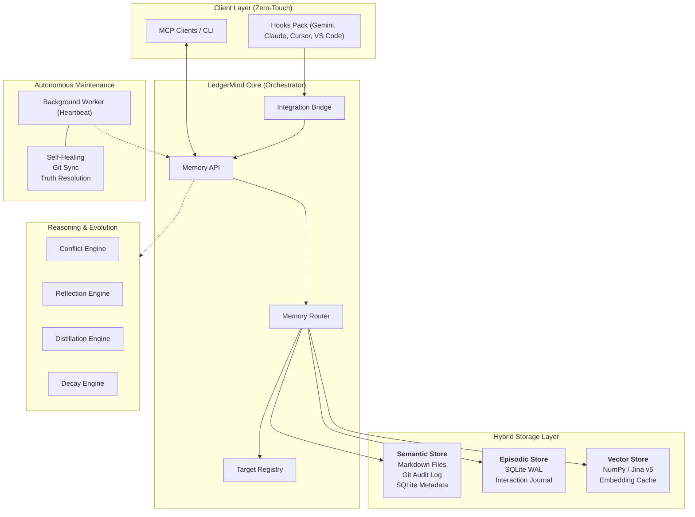

# LedgerMind

**v2.8.6** · Autonomous Memory Management System for AI Agents


> *LedgerMind is not a memory store — it is a living knowledge core that thinks,
> heals itself, and evolves without human intervention.*

[](LICENSE)
[](https://python.org)
[](https://modelcontextprotocol.io)
[](https://pypi.org/project/ledgermind/)
[](https://github.com/sl4m3/ledgermind/stargazers)

---

## Featured On

<p align="center">
  <a href="https://aiagentsdirectory.com/agent/ledgermind?utm_source=badge&utm_medium=referral&utm_campaign=free_listing&utm_content=ledgermind" target="_blank" rel="noopener noreferrer">
    
  </a>
  &nbsp;&nbsp;&nbsp;&nbsp;
  <a href="https://www.agenthunter.io?utm_source=badge&utm_medium=embed&utm_campaign=LedgerMind" target="_blank" rel="noopener noreferrer">
    
  </a>
  &nbsp;&nbsp;&nbsp;&nbsp;
  <a href="https://findyouragent.ai" target="_blank" rel="noopener noreferrer" style="text-decoration: none;">
    
  </a>
</p>

---

## 📈 Recent Activity

**Last 14 days:**
- **2,353 Git clones** (647 unique cloners)
- Strong PyPI growth (hundreds of downloads in recent days)

**Installed & used in:**
- Gemini CLI (100% zero-touch, fully stable)
- Claude Code
- Cursor
- VS Code

**Featured & Published:**
- New article on **Dev.to**: ["True Zero-Touch Autonomus Memory for AI Agents"](https://dev.to/sl4m3/ledgermind-zero-touch-memory-that-survives-real-agent-work-46lh)
- Automaticaly accepted to **PitchHut** directory

---

## ✨ Why LedgerMind?

| Feature                 | Mem0 / LangGraph | LedgerMind          |
|-------------------------|------------------|---------------------|
| Autonomous healing      | ❌               | ✅ (every 5 min)    |
| Git-audit + versioning  | ❌               | ✅                  |
| 4-bit on-device         | ❌               | ✅                  |
| Multi-agent namespacing | Partial          | ✅ Full             |

---

## What is LedgerMind?

Most AI memory systems are passive stores: you write, you read, and if the
information becomes stale or contradictory — that is your problem. LedgerMind
takes a fundamentally different approach.

LedgerMind is an **autonomous knowledge lifecycle manager**. It combines a
hybrid storage engine (SQLite + Git) with a built-in reasoning layer that
continuously monitors knowledge health, detects conflicts, distills raw
experience into structured rules, and repairs itself — all in the background,
without any intervention from the developer or the agent.

### Core Capabilities

| Capability | Description |
|---|---|
| **Zero-Touch Automation** | `ledgermind install <client>` automatically injects hooks into Claude Code, Cursor, or Gemini CLI for 100% transparent memory operations without MCP tool calls. |
| **VS Code Hardcore Mode** | Dedicated VS Code extension for proactive context injection, terminal monitoring, and automated conversation logging without manual tool calls. |
| **Project Bootstrapping** | `bootstrap_project_context` tool for deep analysis of project structure and automatic initialization of the agent's knowledge base. |
| **Autonomous Heartbeat** | A background worker runs every 5 minutes: Git sync, reflection, decay, self-healing. |
| **Git Evolution** | Automatically generates "Evolving Pattern" proposals based on code changes (minimum 2 commits). |
| **Deep Truth Resolution** | Improved recursive resolution of superseded chains to ensure only the latest active truth is returned. |
| **Self-Healing Index** | Automatically rebuilds the SQLite metadata index from Markdown source files if corruption or desync is detected. |
| **Probabilistic Reflection** | Discover patterns using float success weights (0.0-1.0) and Target Inheritance for better clustering. |
| **Procedural Distillation** | Automatically converts successful trajectories into step-by-step instructions (`procedural.steps`). |
| **Intelligent Conflict Resolution** | Vector similarity analysis automatically supersedes outdated decisions (threshold: 70%) or triggers LLM arbitration (50-70%). |
| **Multi-agent Namespacing** | Logical partitioning of memory for multiple agents within a single project. |
| **4-bit GGUF Integration** | Optimized for Termux/Android with embedding caching for maximum stability. |
| **Hybrid Storage** | SQLite for fast queries + Git for cryptographic audit and version history. |
| **MCP Server** | 15 tools with namespacing and pagination support for any compatible client. |

---

## Architecture at a Glance



---

## Installation

```bash
# Basic install
pip install ledgermind

# With 4-bit vector search (recommended for CPU/Mobile)
pkg install clang cmake ninja
pip install llama-cpp-python
pip install ledgermind[vector]
```

**Requirements:** Python 3.10+, Git installed and configured in PATH.

---

## Quick Start

### Option A: Zero-Touch Automation (Recommended)

The easiest way to use LedgerMind is to install the **LedgerMind Hooks Pack**. This automatically configures your LLM client to retrieve context before every prompt and record every interaction without the agent needing to manually call MCP tools.

#### Client Compatibility Matrix

| Client | Event Hooks | Status | Zero-Touch Level |
| :--- | :--- | :---: | :--- |
| **VS Code** | `onDidSave`, `ChatParticipant`, `TerminalData` | ✅ | **Hardcore** (Shadow Context) |
| **Claude Code** | `UserPromptSubmit`, `PostToolUse` | ✅ | **Full** (Auto-record + RAG) |
| **Cursor** | `beforeSubmitPrompt`, `afterAgentResponse` | ✅ | **Full** (Auto-record + RAG) |
| **Gemini CLI** | `BeforeAgent`, `AfterAgent` | ✅ | **Full** (Auto-record + RAG) |
| **Claude Desktop** | *Zero-Touch not available* | ⏳ | Manual MCP tools only |

```bash
# Install hooks for your preferred client (vscode, claude, cursor, or gemini)
# Memory is installed in the parent directory (../.ledgermind) by default for best isolation.
ledgermind install gemini
```
*Now, simply use your client as usual. LedgerMind operates entirely in the background.*

### Option B: Library (Direct Integration)

```python
from ledgermind.core.api.bridge import IntegrationBridge

# NOTE: Using '.ledgermind' in the parent directory (outside the project root) 
# is the recommended standard. This keeps memory isolated from project code,
# prevents context pollution in analysis tools (like 'read_file'), and ensures
# memory is not accidentally committed to source control.
bridge = IntegrationBridge(
    memory_path="../.ledgermind", 
    vector_model="../.ledgermind/models/v5-small-text-matching-Q4_K_M.gguf"
)

# Inject relevant context into your agent's prompt
context = bridge.memory.search_decisions("database migrations", namespace="prod_agent")

# Record a structured decision with namespacing
bridge.memory.record_decision(
    title="Use Alembic for all database migrations",
    target="database_migrations",
    rationale="Alembic provides version-controlled, reversible migrations.",
    namespace="prod_agent"
)
```

### Option B: MCP Server (Secure)

```bash
# Set your API key for security
export LEDGERMIND_API_KEY="your-secure-key"

# Start the MCP server
ledgermind-mcp run --path ledgermind
```

---

## Key Workflows

### Workflow 1: Multi-agent Namespacing — Isolation Within One Core

```python
# Agent A decision
memory.record_decision(title="Use PostgreSQL", target="db", namespace="agent_a")

# Agent B decision (same target, different namespace)
memory.record_decision(title="Use MongoDB", target="db", namespace="agent_b")

# Search only returns what belongs to the agent
memory.search_decisions("db", namespace="agent_a") # -> Returns PostgreSQL
```

### Workflow 2: Hybrid Search & Evidence Boost

LedgerMind uses Reciprocal Rank Fusion (RRF) to combine Keyword and Vector
search. Decisions with more "Evidence Links" (episodic events) receive a
**+20% boost per link** to their final relevance score.

---

## Documentation

| Document | Description |
|---|---|
| [API Reference](docs/API_REFERENCE.md) | Complete reference for all public methods |
| [Integration Guide](docs/INTEGRATION_GUIDE.md) | Library and MCP integration patterns |
| [MCP Tools Reference](docs/MCP_TOOLS.md) | All 15 MCP tools with namespacing and offset |
| [Architecture](docs/ARCHITECTURE.md) | Deep dive into internals and design decisions |
| [Configuration](docs/CONFIGURATION.md) | API keys, Webhooks, and tuning |

---

## Benchmarks (February 26, 2Y, v2.8.6)

LedgerMind is optimized for high-speed operation on **Android/Termux**
as well as containerized environments. It includes built-in security for MCP and
REST endpoints.

### Retrieval Performance (Jina v5 Small Q4_K_M)

| Metric | Mean | Note |
| :--- | :---: | :--- |
| **Search p95 (ms)** | **28.4 ms** | Hybrid RRF (Vector + Keyword) |
| **Write p95 (ms)** | **242.1 ms** | Optimized Metadata Indexing |
| **Memory OPS** | **16.2 ops/s** | Parallelized write throughput |

---

## License

LedgerMind is distributed under the **Non-Commercial Source Available License
(NCSA)**.

---

*LedgerMind — the foundation of AI autonomy.*
